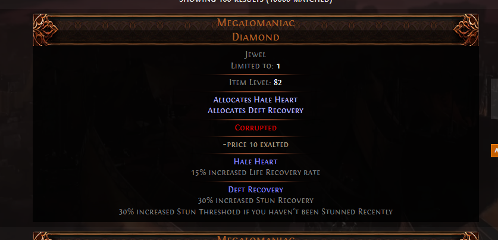

# Path of Exile 2 Allocates skills extension

This extension will address shortcoming of PoE2 trade website, where some items like `Megalomaniac` diamon have their skills listed, but no details about skill.
Extension will add automatically details to item card, just like in case of anointed amulets.

## Installation

### Step 1: Download the Extension
1. Download latest release .zip https://github.com/Delwing/poe2-allocated-skills/releases/download/latest/poe2-allocated-skills.zip and unpack it.

### Step 2: Load the Extension
#### Chrome
1. Open Chrome and navigate to `chrome://extensions/`.
2. Enable **Developer Mode** in the top-right corner.
3. Click **Load Unpacked** and select the folder containing the extension files.
4. The extension will now appear in your list of installed extensions.
